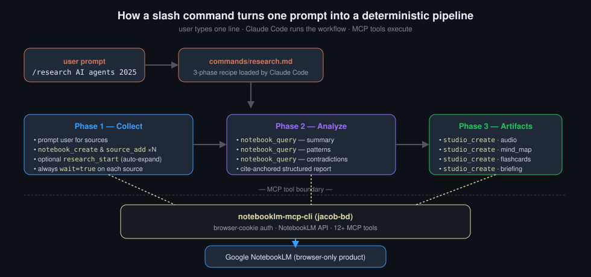
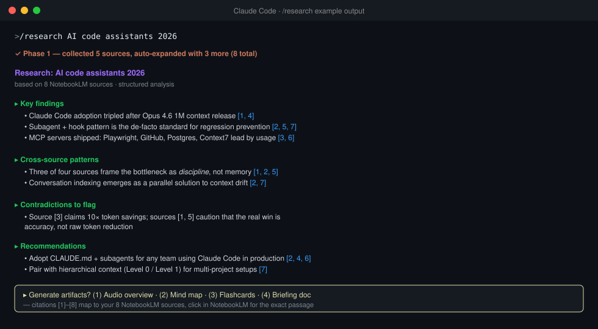

# notebooklm-claude-workflows

[](LICENSE)
[](https://github.com/CreatmanCEO/notebooklm-claude-workflows/stargazers)
[](https://github.com/CreatmanCEO/notebooklm-claude-workflows/actions/workflows/validate.yml)
[](https://github.com/jacob-bd/notebooklm-mcp-cli)
[](https://code.claude.com)
[](https://modelcontextprotocol.io)
[](#prerequisites)

🇬🇧 English · [🇷🇺 Русский](README.ru.md)

**Seven Claude Code slash commands that turn raw NotebookLM MCP tools into one-liners. Tested on 41K-message Telegram forums, YouTube research pipelines, and auto-doc notebooks for 30+ frameworks.**

> **MCP server = Claude has hands in NotebookLM.**
> **Workflow commands = Claude has hands + a checklist.**



## The problem

[notebooklm-mcp-cli](https://github.com/jacob-bd/notebooklm-mcp-cli) gives Claude access to NotebookLM — but as raw tools. Creating a notebook, adding 5 sources, querying, generating a podcast means 10+ manual tool calls. You end up doing the orchestration yourself.

**This project fixes that.** Slash commands turn multi-step NotebookLM operations into one-liners:

```
/research AI agents 2026          → full research pipeline with artifacts
/youtube-research LLM fine-tuning → YouTube videos → analysis → podcast
/init-notebook next.js supabase   → docs notebook for your stack
```

## Why commands, not just MCP?

Claude Code with the MCP server *can* figure out what to do on its own. But there's a difference between "can" and "does it reliably":

| | Raw MCP tools | With workflow commands |
|---|---|---|
| Creates notebook | yes | yes |
| Adds sources with `wait=true` | sometimes forgets | always |
| Multi-angle analysis (summary + patterns + contradictions) | usually asks 1 question | always runs full series |
| Suggests artifacts (podcast, mind map) | rarely | always |
| Structured output with citations | inconsistent | standardised |
| Works the same every time | depends on context / mood | deterministic |

Commands are not a crutch — they're **process standardisation**. The difference between *"write me a deploy script"* and `make deploy`. Claude has the tools either way, but commands guarantee the workflow quality every time.

## What `/research` returns



Citations `[1]–[8]` map to your NotebookLM sources — click any of them in NotebookLM to jump to the exact passage.

## Measured impact

Real production scenarios with concrete numbers:

| Scenario | Without workflow commands | With workflow commands |
|---|---|---|
| Research pipeline (5 sources → analysis → podcast) | 10+ manual tool calls, ~3 min of orchestration | 1 prompt, autonomous |
| Telegram forum supergroup ingestion | Not solvable — single source > 500 KB limit | 41 K messages · 12 topics · 586 K words · 13 NotebookLM sources, **under 2 minutes** |
| YouTube transcript collection | YouTube transcript APIs return HTTP 429 / are blocked | 1–10 videos via NotebookLM native ingest, no API keys |
| Stack docs notebook | Manual: find URL × N, paste × N | `/init-notebook fastapi postgres redis` — 30+ frameworks pre-mapped |
| Cookie auth monitoring | "Find out cookies expired when something breaks" | Daily check, Windows toast notification before things break |

## What's inside

### Slash commands

| Command | What it does |
|---|---|
| `/research <topic>` | Full cycle: collect → auto-expand via web search → multi-query analysis → Obsidian export → optional artifacts |
| `/deep-research <topic>` | Multi-iteration deep dive: builds topic tree, asks 3–5 questions per topic, synthesises comprehensive report with knowledge hierarchy |
| `/youtube-research <topic>` | YouTube video analysis via NotebookLM. Replaces broken transcript APIs (429 errors). 1–10 videos → structured analysis with citations |
| `/init-notebook <stack>` | Auto-create a NotebookLM notebook with official docs for your tech stack. URL hints for 30+ popular frameworks |
| `/telegram-to-notebook` | Import Telegram chats including **forum supergroups with topics**. Auto-detects topic structure, per-topic export, filters stickers/GIFs/video, keeps text/code/PDFs |
| `/analytics-report` | Feed analytics data (CSV / JSON / API) → NotebookLM analysis → infographic, data table, slides, or briefing doc |
| `/edit-source` | Edit NotebookLM sources via the extract → edit → replace workaround. Supports Drive sync for Google Docs sources |

### When to use which research command

| Use case | Pick |
|---|---|
| One-pass research with 3 angles (summary / patterns / contradictions) | `/research` |
| 5-question-per-topic deep dive that builds a knowledge tree | `/deep-research` |
| Specifically YouTube videos as primary sources | `/youtube-research` |
| Telegram forum / supergroup ingestion | `/telegram-to-notebook` |

### Automation

| Component | What it does |
|---|---|
| `nlm-auth-check.sh` | Daily cookie health check with Windows toast notifications when auth expires |
| `setup-nlm-scheduler.ps1` | One-click Windows Task Scheduler setup for the auth check |
| `config/CLAUDE.md` | Global instructions so Claude proactively suggests NotebookLM when working with unfamiliar tech |

## Prerequisites

- [Claude Code](https://docs.anthropic.com/en/docs/claude-code) installed and working
- [notebooklm-mcp-cli](https://github.com/jacob-bd/notebooklm-mcp-cli) installed and authenticated:
  ```bash
  uv tool install notebooklm-mcp-cli
  nlm login
  nlm setup add claude-code
  ```
- Restart Claude Code after MCP setup

## Installation

### Quick (one command)

Open Claude Code and say:

```
Clone https://github.com/CreatmanCEO/notebooklm-claude-workflows and install
```

Claude will clone the repo and copy commands to the right places.

### Manual

```bash
# Clone
git clone https://github.com/CreatmanCEO/notebooklm-claude-workflows.git ~/notebooklm-claude-workflows

# Copy slash commands
cp ~/notebooklm-claude-workflows/commands/*.md ~/.claude/commands/

# (Optional) Add NotebookLM instructions to global config
# Safe append — won't duplicate if already present
grep -q "notebooklm-claude-workflows" ~/.claude/CLAUDE.md 2>/dev/null || \
  cat ~/notebooklm-claude-workflows/config/CLAUDE.md >> ~/.claude/CLAUDE.md

# (Optional) Auth monitoring — Windows only
mkdir -p ~/Documents/scripts
cp ~/notebooklm-claude-workflows/scripts/* ~/Documents/scripts/
chmod +x ~/Documents/scripts/nlm-auth-check.sh
powershell -ExecutionPolicy Bypass -File ~/Documents/scripts/setup-nlm-scheduler.ps1
```

Restart Claude Code. New commands appear automatically.

## Command details

### /research — Full research pipeline

Three phases, fully autonomous:

**Phase 1 — Collect** · Creates a NotebookLM notebook, accepts any mix of sources (YouTube, web pages, Google Drive, raw text), adds them with progress tracking. Optionally auto-expands the source set via NotebookLM's `research_start` tool.

**Phase 2 — Analyse** · Runs a series of targeted queries against the notebook — summarisation, pattern detection, contradiction analysis, plus your custom questions. Returns a structured report with citations from your sources.

**Phase 3 — Artifacts** · Optionally generates NotebookLM Studio content:

| Artifact | Format | Use case |
|---|---|---|
| Audio Overview | MP3 | Podcast with two AI hosts discussing your sources |
| Mind Map | JSON | Visual knowledge structure |
| Flashcards | JSON / HTML | Study cards from source material |
| Briefing Doc | Markdown | Executive summary |
| Quiz | JSON / HTML | Test your understanding |

### /youtube-research — YouTube without 429 errors

YouTube transcript APIs are increasingly blocked (HTTP 429). NotebookLM ingests YouTube natively — no API keys, no rate limits.

```
/youtube-research React Server Components

> Paste 1–10 YouTube links:
https://youtu.be/abc123
https://youtu.be/def456
https://youtu.be/ghi789

→ Creates notebook, ingests all videos
→ Structured analysis with per-video summaries
→ Cross-video patterns and insights
→ Optional: generate podcast from all videos
```

### /init-notebook — Documentation for your stack

Creates a NotebookLM notebook pre-loaded with official docs for your technologies:

```
/init-notebook fastapi postgresql redis

→ Creates "fastapi postgresql redis Docs" notebook
→ Adds FastAPI docs, PostgreSQL docs, Redis docs
→ Ready for queries: "How do I set up connection pooling with FastAPI + PostgreSQL?"
```

Built-in URL hints for 30+ frameworks (Next.js, React, Supabase, Tailwind, Drizzle, Playwright, Electron, and more). Works with any URL — not limited to the built-in list.

### /telegram-to-notebook — Forum chats with topics

The only tool that handles Telegram **forum supergroups** (chats with nested topics / threads). Automatically detects topic structure and offers three export modes:

```
/telegram-to-notebook result.json

> 12 topics detected:
  [598] Latest: 69 messages
  [599] Offtop RU: 10,627 messages
  [17296] Docker: 867 messages
  ...

> Export mode?
  1. Per-topic (separate file per topic) ← best for targeted analysis
  2. Filtered (only specific topics)
  3. All together (single file with topic headers)
```

**Smart filtering:** skips stickers, GIFs, video files. Keeps text messages, code snippets, shared documents (PDF, JSON, YAML, Python, Go, etc.). Optimised for IT communities and research channels.

**Tested:** 41 K messages, 12 topics, 586 K words → 13 files uploaded to NotebookLM in under 2 minutes.

```bash
# List topics without exporting
python scripts/telegram-chunker.py result.json --list-topics

# Export all topics separately
python scripts/telegram-chunker.py result.json --per-topic

# Export only Docker and FAQ topics
python scripts/telegram-chunker.py result.json --per-topic --topics "Docker,FAQ Remake"
```

## Auth monitoring

NotebookLM uses browser cookies (no official API). Cookies expire. The auth check script runs daily and alerts you before things break:

```
[2026-03-23 10:00:01] AUTH OK — 5 notebooks accessible
[2026-03-25 10:00:01] AUTH EXPIRED — run: nlm login
```

On Windows: toast notification when cookies expire. On Linux/macOS: log file only (PRs welcome for native notifications — see [`CONTRIBUTING.md`](CONTRIBUTING.md)).

## Configuration

### CLAUDE.md integration

The included `config/CLAUDE.md` teaches Claude to proactively check NotebookLM when working with unfamiliar libraries. Append it to your global config:

```bash
# Safe append — won't duplicate if already present
grep -q "notebooklm-claude-workflows" ~/.claude/CLAUDE.md 2>/dev/null || \
  cat ~/notebooklm-claude-workflows/config/CLAUDE.md >> ~/.claude/CLAUDE.md
```

Before: you have to remember to ask Claude to use NotebookLM.
After: Claude suggests it automatically when it would help.

## Limitations

This is a workflow layer on top of `notebooklm-mcp-cli`, which is in turn a wrapper around an unofficial NotebookLM browser API. Honest constraints:

- **Cookie expiry is real and recurring.** NotebookLM has no official API; the MCP server uses browser cookies, which expire on Google's schedule (typically every few weeks). The included auth-check script catches this proactively, but you still need to run `nlm login` to refresh. Plan for ~30 seconds of friction every 2–3 weeks.
- **500 K word limit per source.** NotebookLM caps each source at 500 K words. The Telegram chunker defaults to 300 K words per chunk to leave headroom. For very large corpora, expect to upload multiple chunks per topic.
- **`/edit-source` is a workaround, not native.** NotebookLM has no edit-source API. The command extracts → edits → replaces, which means a brief window where the source is missing from the notebook. Avoid running it mid-query.
- **Forum supergroup detection is heuristic.** The Telegram chunker detects topics by scanning for `topic_message_id` fields and `forum_topic_created` actions. Telegram has changed export formats before; if your export is from an old client version, topic detection may misclassify messages. Use `--list-topics` first to verify before bulk export.
- **NotebookLM rate limits are opaque.** Google does not publish them. The MCP server retries on 429, but heavy-research sessions (50+ queries in a row) can occasionally stall. Workaround: split into multiple notebooks.
- **Slash commands are Claude Code specific.** Claude Desktop users get the raw MCP tools but no workflow automation — see [notebooklm-mcp-cli](https://github.com/jacob-bd/notebooklm-mcp-cli) for Desktop setup.
- **Native notifications are Windows-only for now.** macOS `osascript` and Linux `notify-send` paths are open contributions in [`CONTRIBUTING.md`](CONTRIBUTING.md).
- **The whole system depends on the upstream MCP server.** If `notebooklm-mcp-cli` breaks, every command in this repo breaks too. Pin a known-good MCP version in production.

## FAQ

**Q: Is this an MCP server?**
No. This is a workflow layer on top of [notebooklm-mcp-cli](https://github.com/jacob-bd/notebooklm-mcp-cli). Think of it as macros + templates for the MCP tools. You need the MCP server installed first.

**Q: Does this work with Claude Desktop?**
The slash commands are Claude Code specific. Claude Desktop users get the MCP tools directly but without the workflow automation. See [notebooklm-mcp-cli docs](https://github.com/jacob-bd/notebooklm-mcp-cli) for Desktop setup.

**Q: What about cookie expiration?**
The auth monitoring script checks daily and notifies you. When cookies expire, just run `nlm login` — takes 30 seconds.

**Q: Can I add my own commands?**
Absolutely. Drop any `.md` file into `~/.claude/commands/` following the same format. See the existing commands for examples and [`CONTRIBUTING.md`](CONTRIBUTING.md) for priorities.

## Project structure

```
notebooklm-claude-workflows/
├── commands/
│   ├── research.md            # /research — full pipeline
│   ├── deep-research.md       # /deep-research — multi-iteration deep dive
│   ├── youtube-research.md    # /youtube-research — YouTube via NotebookLM
│   ├── init-notebook.md       # /init-notebook — stack docs notebook
│   ├── telegram-to-notebook.md # /telegram-to-notebook — forum-aware import
│   ├── analytics-report.md    # /analytics-report — data → infographic / report
│   └── edit-source.md         # /edit-source — extract → edit → replace
├── scripts/
│   ├── telegram-chunker.py    # Telegram JSON → NotebookLM chunks (forum-aware)
│   ├── nlm-auth-check.sh      # Daily auth cookie check
│   └── setup-nlm-scheduler.ps1 # Windows Task Scheduler installer
├── config/
│   └── CLAUDE.md              # Global Claude Code instructions snippet
├── docs/
│   ├── architecture.svg       # pipeline diagram
│   └── output-mockup.svg      # /research output mock-up
├── README.md
├── README.ru.md
├── CHANGELOG.md
├── CONTRIBUTING.md
├── CLAUDE.md                  # Level 1 file for this repo (eats own dog food)
├── LICENSE
└── .github/workflows/validate.yml
```

## Related

- [notebooklm-mcp-cli](https://github.com/jacob-bd/notebooklm-mcp-cli) — the MCP server this project builds on (required)
- [Claude Code Anti-Regression Setup](https://github.com/CreatmanCEO/claude-code-antiregression-setup) — sister repo, same author. CLAUDE.md + subagents + hooks to prevent Claude from regressing your code while running these workflows.
- [ai-context-hierarchy](https://github.com/CreatmanCEO/ai-context-hierarchy) — sister repo. Three-level context system; the `config/CLAUDE.md` here is a Level 0 fragment that fits naturally into that hierarchy.
- [claude-statusline](https://github.com/CreatmanCEO/claude-statusline) — sister repo. Smart status line for Claude Code; complementary tool from the same ecosystem.

## Contributing

PRs welcome — see [CONTRIBUTING.md](CONTRIBUTING.md). Current priorities: native notifications for Linux/macOS auth-check, expanded URL dictionary in `/init-notebook`, additional slash commands (PDF research, podcast-to-notebook), translations of command files into other locales.

## Author

**Nick Podolyak** — Python developer and digital architect at [CREATMAN](https://creatman.site)

- GitHub: [@CreatmanCEO](https://github.com/CreatmanCEO)
- Habr: [creatman](https://habr.com/ru/users/creatman/)
- dev.to: [@creatman](https://dev.to/creatman)

## License

[MIT](LICENSE) · Nick Podolyak
